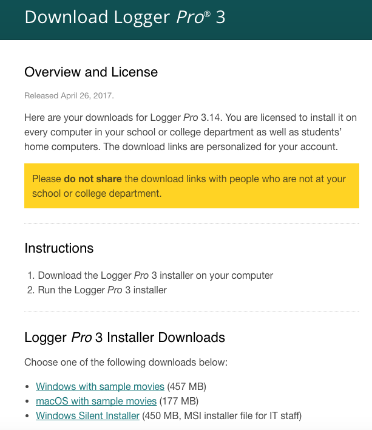

### LoggerPro_License vs. Update?

The original LoggerPro_Update download recipe points to the publicly available Vernier update URL, which requires an originally licensed installation to have occurred in order to install.

For individuals and institutions with licensed versions of the software, when logging into your Vernier account online you can actually use your unique licensed software URLs in the download recipe instead!



Each of your licensed software contain unique links for Mac & Windows.  The only difference between these is a unique 5-digit number at the end of the URL. Right-click and copy the download URL for Mac or Windows download you care about. It will look something like this:

ex. `https://vernier.com/d/XXXXX`

### How to Use These Recipes

1. Add my repo to autopkg.
```
autopkg repo-add https://github.com/autopkg/apizz-recipes.git
```

2. Create overrides for the desired recipe (.download, .pkg, or .munki)
- You can change the override recipe name should the major version of the software change in the future (ex. LoggerPro4)

3. Substitute your unique Vernier licensed software download URL in the `DOWNLOAD_URL` input entry

4. Update the Logger Pro major version number as necessary (`MAJOR_VERSION`)

### LoggerPro_License Recipe Differences from LoggerPro_Update

#### LoggerPro3.download.recipe

1. Template `DOWNLOAD_URL` recipe Input for entering your own licensed Vernier software link in your override, where XXXXX is your unique 5-digit letter & number string.
```
<key>DOWNLOAD_URL</key>
<string>https://www.vernier.com/d/XXXXX</string>
```
2. Because there is a static URL which will always download the latest version of the Vernier software, we don't need to utilize the `URLTextSearcher` processor at all.

3. Added `MAJOR_VERSION` input variable should Logger Pro ever move beyond version 3 for recipe override future-proofing.
```
<key>MAJOR_VERSION</key>
<string>3</string>
```
4. Added the `CodeSignatureVerifier` processor to make sure the LoggerPro.dmg file we download contains the expected installer PKG.

#### LoggerPro3.pkg.recipe

1. Like the download recipe, added `MAJOR_VERSION` input variable.
2. In using the licensed static `DOWNLOAD_URL`, the LoggerPro_Update method for ascertaining the version is not possible. So, we need to do some unpacking in order to get the version from the app's Info.plist file.
```
<dict>
    <key>Arguments</key>
    <dict>
	<key>flat_pkg_path</key>
	<string>%pathname%/Install Logger Pro %MAJOR_VERSION%.pkg</string>
	<key>destination_path</key>
	<string>%RECIPE_CACHE_DIR%/unpack</string>
    </dict>
    <key>Processor</key>
    <string>FlatPkgUnpacker</string>
</dict>
<dict>
    <key>Arguments</key>
    <dict>
	<key>destination_path</key>
	<string>%RECIPE_CACHE_DIR%/unpack</string>
	<key>pkg_payload_path</key>
	<string>%RECIPE_CACHE_DIR%/unpack/apponly.pkg/Payload</string>
    </dict>
    <key>Processor</key>
    <string>PkgPayloadUnpacker</string>
</dict>
<dict>
    <key>Arguments</key>
    <dict>
	<key>input_plist_path</key>
	<string>%RECIPE_CACHE_DIR%/unpack/Logger Pro.app/Contents/Info.plist</string>
    </dict>
    <key>Processor</key>
    <string>Versioner</string>
</dict>
```
3. With the app's version, use the `PkgCopier` processor to copy the original installer PKG but rename it with the standard autopkg `%NAME%-%version%.pkg` and lastly do some cleanup.
```
<dict>
    <key>Arguments</key>
    <dict>
	<key>pkg_path</key>
	<string>%RECIPE_CACHE_DIR%/%NAME%-%version%.pkg</string>
	<key>source_pkg</key>
	<string>%pathname%/Install Logger Pro %MAJOR_VERSION%.pkg</string>
    </dict>
    <key>Processor</key>
    <string>PkgCopier</string>
</dict>
<dict>
    <key>Arguments</key>
    <dict>
	<key>path_list</key>
	<array>
	    <string>%RECIPE_CACHE_DIR%/unpack</string>
	</array>
    </dict>
    <key>Processor</key>
    <string>PathDeleter</string>
</dict> 
```
